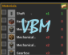

# 可视化蓝图材料 (Visual Blueprint Materials)

## 开源与商用声明
本项目基于 MIT 协议开源，由 AlkSur (GitHub) 开发。

- **免费场景**：个人单机游玩、非盈利公益服、本地学习修改（完全免费无限制）。
- **受限场景**：任何盈利行为均需获得作者 AlkSur 的**正式书面商用授权**。
  包括但不限于付费整合包、商业收费服务器、商业二次开发、使用本项目 GUI/鼠标拦截/UI 偏移核心逻辑进行付费外包和商业销售。

本项目所有代码均包含 AI 辅助开发与人工审核，最终版权归属 AlkSur。未经授权的商业使用一律禁止。

## 功能介绍
读取机械动力（Create）蓝图剪贴板中的材料清单，在背包、箱子、AE/RS 终端等界面可视化展示所需物品及背包库存数量。

- 📋 自动解析 Create 蓝图剪贴板 NBT 数据
- 📦 背包 / 箱子 / AE终端 / RS终端 右侧显示快捷按钮
- 🔍 展开面板：物品图标 × 需求数量 × 库存数量（绿/红颜色标识）
- ✅ 复选框标记已收集 / 忽略物品，写入剪贴板 NBT 持久化
- 🔒 **Lock Panel** 锁定面板：打开容器自动展开，关闭自动收起
- ⌨️ **R 键**查看合成配方 / **U 键**查看用途（需安装 JEI）
- 🎨 面板智能定位至容器**左侧**，零遮挡物品槽和 JEI 界面
- 🧩 兼容 Create 0.5.x 和 6.x 双版本

## 前置模组
| 模组 | 必需 | 版本 |
|------|:--:|------|
| Minecraft | ✅ | 1.20.1 |
| Forge | ✅ | 47.x |
| Create（机械动力） | ✅ | 0.5.x 或 6.x |
| JEI | ❌ | 15.x（可选，用于 R/U 键配方查询） |

## 安装
将 `vbm-{version}.jar` 放入游戏目录 `mods/` 文件夹。

## 开源协议
MIT 协议 + 补充商用限制条款。详见 [LICENSE](LICENSE) 与 [COMMERCIAL_LICENSE.md](COMMERCIAL_LICENSE.md)。
